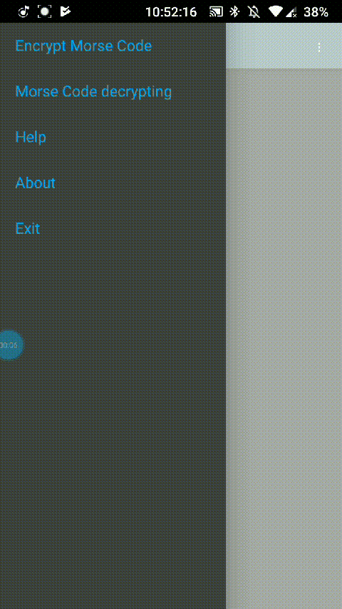

MorseCode for android

## Features ##
- Supports both Russian and English text.
- Ability to translate text to Morse code and back.

## Usage

1. Launch the application on your Android device.
2. Enter text into the input field.
3. Open the side panel to choose the operation:
   - Swipe from the left edge of the screen.
4. Select the desired operation:
   - "To Morse" to translate text into Morse code.
   - "Back" to decode Morse code back into text.

## Runtime Requirements

- Minimum Android version: Android 4.1 (API level 16).

## License

This project is licensed under the [GNU General Public License v3.0](LICENSE).

